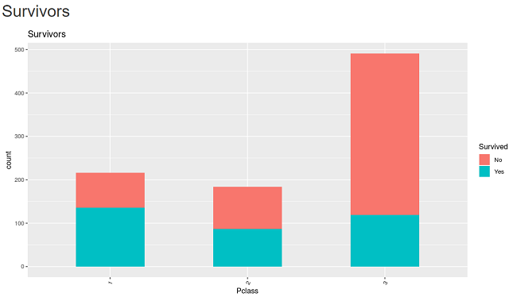

```{r setup, include=FALSE}
knitr::opts_chunk$set(echo = FALSE)
library(shiny)
library(titanic)
train <- titanic_train
test <- titanic_test

## Preprocessing
### Factorizing
train$Pclass <- factor(train$Pclass)
train$Sex <- factor(train$Sex)
train$SibSp <- factor(train$SibSp)
train$Parch <- factor(train$Parch)
train$Embarked <- factor(train$Embarked)
train$Survived <- factor(train$Survived)
test$Pclass <- factor(test$Pclass)
test$Sex <- factor(test$Sex)
test$SibSp <- factor(test$SibSp)
test$Parch <- factor(test$Parch)
test$Embarked <- factor(test$Embarked)

classChoices <- c(unique(levels(train$Pclass)))
sexChoices <- c(unique(levels(train$Sex)))
sibspChoices <- c(unique(levels(train$SibSp)))
parchChoices <- c(unique(levels(train$Parch)))
embarkedChoices <- c(unique(levels(train$Embarked)))
variableChoices <- c("Pclass","Sex","Embarked")
```

## Overview

### Intoduction

- Explore titanic incident data with many variables
- Allow users to explore data and do basic EDA easily
- Explain how to use the application

Application URL: https://jinkwanh.shinyapps.io/tatanic2/

## Main Panel

- Bar plot to summarize how many people survived or perished
- Table data to see the detail of the people

## Plot



## Table


## Side Panel

- Select variable to control the plot
- Filter out the information to display

